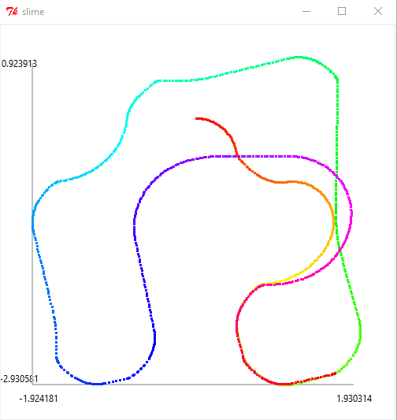
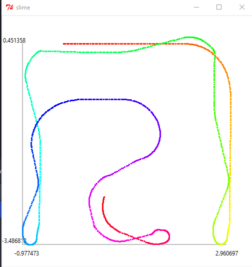

# [designLab2](MIT6_01SCS11_designLab02.pdf)

## State Transition Diagram

## Results

### 1. **tutorial**
   
https://github.com/Muhammed-Abdullah-Shaikh/MIT-6.01SC-Introduction-To-Electrical-Engineering-And-Computer-Science-I/assets/136577697/0bdca7f9-88ee-4204-b92a-bbd7f064d981

### 2. **mazeWorld**

https://github.com/Muhammed-Abdullah-Shaikh/MIT-6.01SC-Introduction-To-Electrical-Engineering-And-Computer-Science-I/assets/136577697/1e0da0be-8d56-4670-88ea-55d6656cdfc5

