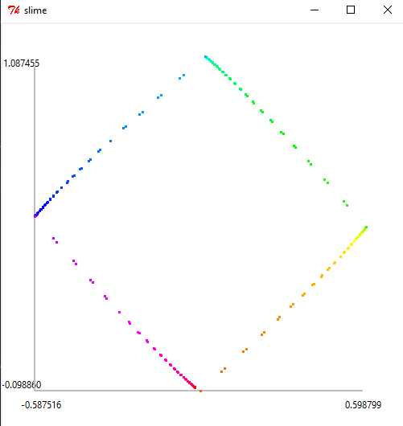

# Unit 2 Signals and Systems

<!-- My Notes: [Unit 1 Software Engineering\MIT 6.01SC Unit 2 Software Engineering Notes.pdf]() -->

# [designLab3](https://ocw.mit.edu/courses/6-01sc-introduction-to-electrical-engineering-and-computer-science-i-spring-2011/resources/mit6_01scs11_designlab03/)

## Results

### Objective 3. **Hip to be Square**

#### a. CombinedDynamicMoveToPoint

#### b. SequentialDynamicMoveToPoint

### Objective 5. **I am a ballerina**
 The robot gracefully dance the pattern of a secret message

