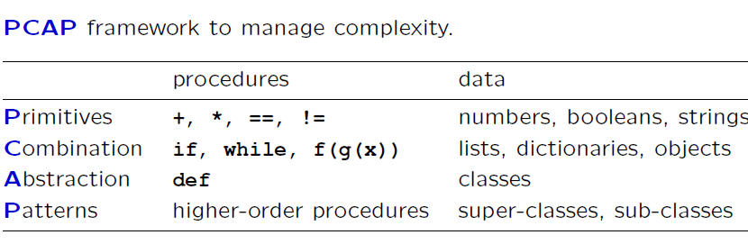

# Unit 1: Software Engineering


```{pdf-include} ../../../../Unit 1 Software Engineering/MIT 6.01SC Unit 1 Software Engineering Notes.pdf

```

## Lecture 1 OOP

### Lecture Handout:

[Lecture 1 handout](https://ocw.mit.edu/courses/6-01sc-introduction-to-electrical-engineering-and-computer-science-i-spring-2011/9083a2e7e6d95c24695b08509bd15bd4_MIT6_01SCS11_lec01_handout.pdf)

### Readings

Read chapters 1-3 of the course notes.

- [Chapter 1: Course Overview (PDF)](https://ocw.mit.edu/courses/6-01sc-introduction-to-electrical-engineering-and-computer-science-i-spring-2011/resources/mit6_01scs11_chap01/)
- [Chapter 2: Learning to Program in Python (PDF)](https://ocw.mit.edu/courses/6-01sc-introduction-to-electrical-engineering-and-computer-science-i-spring-2011/resources/mit6_01scs11_chap02/)
- [Chapter 3: Programs and Data (PDF - 1.6MB)](https://ocw.mit.edu/courses/6-01sc-introduction-to-electrical-engineering-and-computer-science-i-spring-2011/resources/mit6_01scs11_chap03/)

### My Notes

- Humans deal with complexity by exploiting the power of abstraction and modularity
- Modularity is the idea of building components that can be re-used; and abstraction is the idea that after constructing a module (be it software or circuits or gears), most of the details of the module construction can be ignored and a simpler description used for module interaction.
- Lack of modularity makes it very difficult to design large systems, because two different people,
or the same person at two different times, cannot design pieces and put them together without
understanding the whole.
- the key point is that good modules preserve abstraction barriers between the use of a module
and internal details of how they are constructed
- Think of a transducer as a processing box that runs continuously.
- In the context of our PCAP framework, object-oriented programming will give us methods for capturing common patterns in data and the procedures that operate on that data, via classes, generic functions, and inheritance.
- 
    

    

### Design Lab 01

[Github Link](https://github.com/Muhammed-Abdullah-Shaikh/MIT-6.01SC-Introduction-To-Electrical-Engineering-And-Computer-Science-I/tree/master/Unit%201%20Software%20Engineering)

```{literalinclude} ../../../Unit 1 Software Engineering/designLab01/designLab01Work.py
:language: python
:lines: 10-16, 20-40,43-124
```

## Lecture 2 State Machines

### Lecture Handout

[Lecture 2 Handout](https://ocw.mit.edu/courses/6-01sc-introduction-to-electrical-engineering-and-computer-science-i-spring-2011/6befa2f7542ca110af48020a8c8cf8ad_MIT6_01SCS11_lec02_handout.pdf)

### Reading

Read chapter 4.1 of the course notes.

- [Chapter 4: State Machines (PDF)](https://ocw.mit.edu/courses/6-01sc-introduction-to-electrical-engineering-and-computer-science-i-spring-2011/resources/mit6_01scs11_chap04/)

### My Notes

- State machines are a method of modeling systems whose output depends on the entire history of their inputs, and not just on the most recent input.
- State machine models can either be continuous time or discrete time.
- we can think of the job of an embedded system as performing a transduction from a stream (infinite sequence) of input values to a stream of output values
- **Primitive state machines**
We can specify a transducer (a process that takes as input a sequence of values which serve as
inputs to the state machine, and returns as output the set of outputs of the machine for each input)
as a state machine (SM) by specifying:
    - set of states, S,
    - a set of inputs, I, also called the input vocabulary,
    - a set of outputs, O, also called the output vocabulary,
    - a next-state function, n(it, st) 7→ st+1, that maps the input at time t and the state at time t to
    the state at time t + 1,
    - an output function, o(it, st) 7→ ot, that maps the input at time t and the state at time t to the
    output at time t; and
    - an initial state, s0, which is the state at time 0.
- It is important to note that getNextValues does not change the state of the machine, in other words, it does not mutate a state variable. Its job is to be a pure function:

### Software Lab 02

[Github Link](https://github.com/Muhammed-Abdullah-Shaikh/MIT-6.01SC-Introduction-To-Electrical-Engineering-And-Computer-Science-I/tree/master/Unit%201%20Software%20Engineering)

### Design Lab 02

[Github Link](https://github.com/Muhammed-Abdullah-Shaikh/MIT-6.01SC-Introduction-To-Electrical-Engineering-And-Computer-Science-I/tree/master/Unit%201%20Software%20Engineering)

```{include} ../../../Unit 1 Software Engineering/README.md
:heading-offset: 1
:relative-images:
:relative-docs: .
:start-line: 5
```
Code:
```{eval-rst}
.. autoclass:: boundaryBrain::MySMClass
   :members:
   :undoc-members:
```